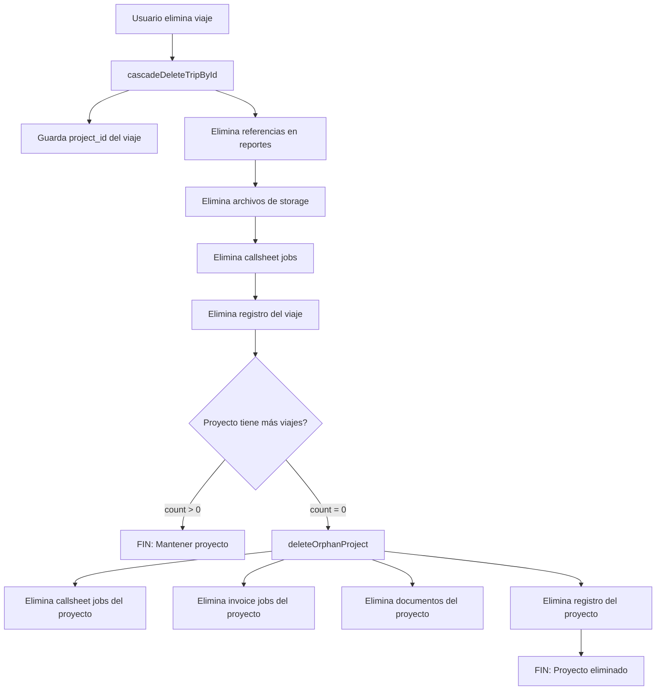

# Eliminación Automática de Proyectos Huérfanos

## Cambio implementado (31 Dec 2025)

### Problema
Cuando se eliminaban viajes desde la vista de Trips, los proyectos a los que pertenecían se quedaban en la base de datos aunque no tuvieran ningún viaje asociado, generando proyectos "huérfanos".

### Solución
Se modificó la función `cascadeDeleteTripById()` en [`src/lib/cascadeDelete.ts`](src/lib/cascadeDelete.ts) para:

1. **Capturar el `project_id`** del viaje antes de eliminarlo
2. **Verificar si el proyecto queda sin viajes** después de la eliminación
3. **Eliminar automáticamente el proyecto** si `count === 0` usando la nueva función `deleteOrphanProject()`

### Función auxiliar: `deleteOrphanProject()`
Esta nueva función realiza una limpieza completa del proyecto huérfano:
- ✅ Elimina callsheet jobs vinculados al proyecto
- ✅ Elimina archivos de storage asociados
- ✅ Elimina invoice jobs usando `cascadeDeleteInvoiceJobById()`
- ✅ Elimina documentos del proyecto (`project_documents`)
- ✅ Elimina el registro del proyecto
- ⚠️ Usa `console.warn()` en lugar de `throw` para no bloquear la eliminación del viaje si hay errores menores

### Flujo completo



### Archivos modificados
- [`src/lib/cascadeDelete.ts`](src/lib/cascadeDelete.ts)
  - `cascadeDeleteTripById()`: Agregada verificación de proyectos huérfanos (líneas ~150-165)
  - `deleteOrphanProject()`: Nueva función auxiliar para limpieza segura de proyectos (líneas ~167-242)

### Consideraciones técnicas

#### Verificación de conteo
```typescript
const { count, error: countError } = await supabase
  .from("trips")
  .select("id", { count: "exact", head: true })
  .eq("project_id", projectId);

if (count === 0) {
  await deleteOrphanProject(supabase, projectId);
}
```

#### Manejo de errores
- La función usa `console.warn()` para errores no críticos
- La verificación de `isMissingColumnOrSchema()` previene fallos en migraciones incompletas
- Los errores en la eliminación de proyectos no bloquean la eliminación del viaje principal

### Testing recomendado

Para verificar el funcionamiento:

1. **Crear un proyecto con 1 solo viaje**
   - Ir a Trips → Crear viaje
   - Asignar a un proyecto nuevo

2. **Eliminar ese viaje**
   - Click en icono de borrar en la tabla
   - Confirmar eliminación

3. **Verificar en Supabase**
   ```sql
   -- El proyecto NO debe aparecer
   SELECT * FROM projects WHERE name = 'nombre_del_proyecto';
   
   -- Verificar que no quedaron residuos
   SELECT * FROM callsheet_jobs WHERE project_id = 'uuid_del_proyecto';
   SELECT * FROM invoice_jobs WHERE project_id = 'uuid_del_proyecto';
   SELECT * FROM project_documents WHERE project_id = 'uuid_del_proyecto';
   ```

4. **Caso edge: Proyecto con múltiples viajes**
   - Crear proyecto con 3 viajes
   - Eliminar 1 viaje → Proyecto debe permanecer
   - Eliminar 1 viaje → Proyecto debe permanecer
   - Eliminar último viaje → **Proyecto se elimina automáticamente**

### Beneficios

✅ **Base de datos más limpia**: No acumula proyectos sin viajes  
✅ **UX mejorada**: Los usuarios no ven proyectos vacíos en la lista  
✅ **Rendimiento**: Menos registros huérfanos en consultas de proyectos  
✅ **Cascade delete completo**: Elimina todos los recursos asociados (storage, jobs, docs)  
✅ **Retrocompatibilidad**: Funciona con esquemas legacy usando `isMissingColumnOrSchema()`  

### Notas adicionales

- La eliminación de proyectos desde la vista de Projects sigue usando `cascadeDeleteProjectById()` (sin cambios)
- La eliminación en bulk de viajes también se beneficia de este cambio
- Si un viaje no tiene `project_id`, la verificación se omite (`if (projectId) {...}`)
